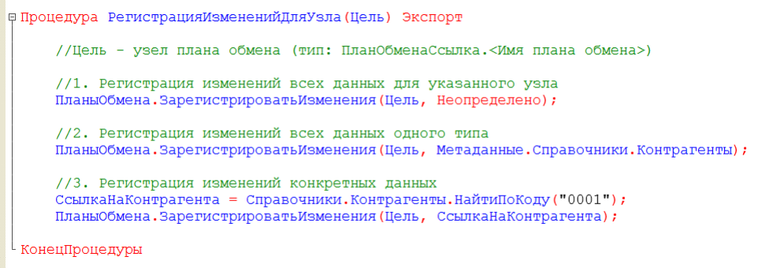
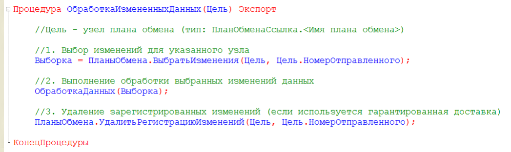

## Планы обмена 1С
Используются для отслеживания и регистрации изменений объектов в базе данных 1С.

### Зарегистрировать изменения данных программно:

### Получить изменения для узла обмена

## Универсальный обмен данными в формате XML
