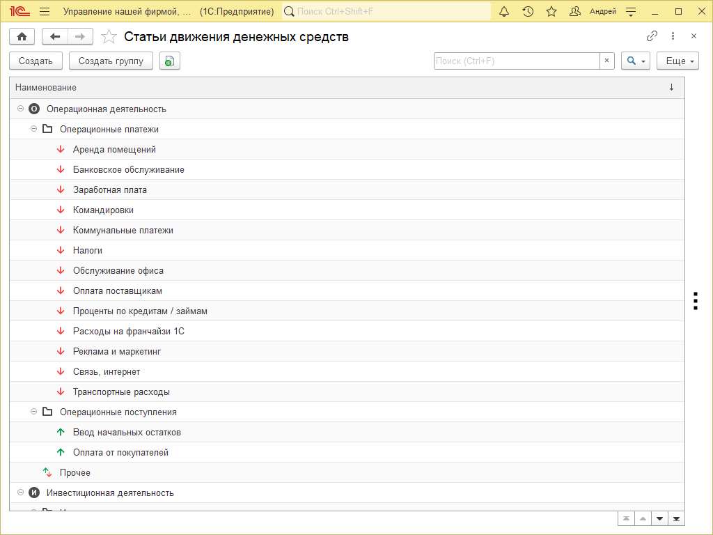
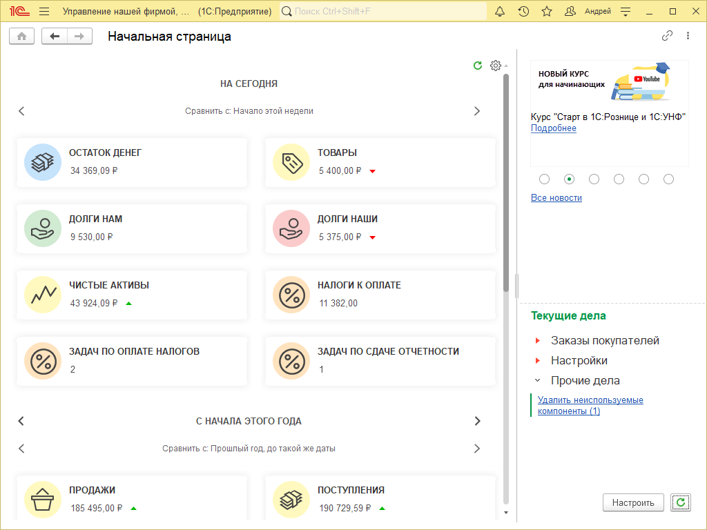
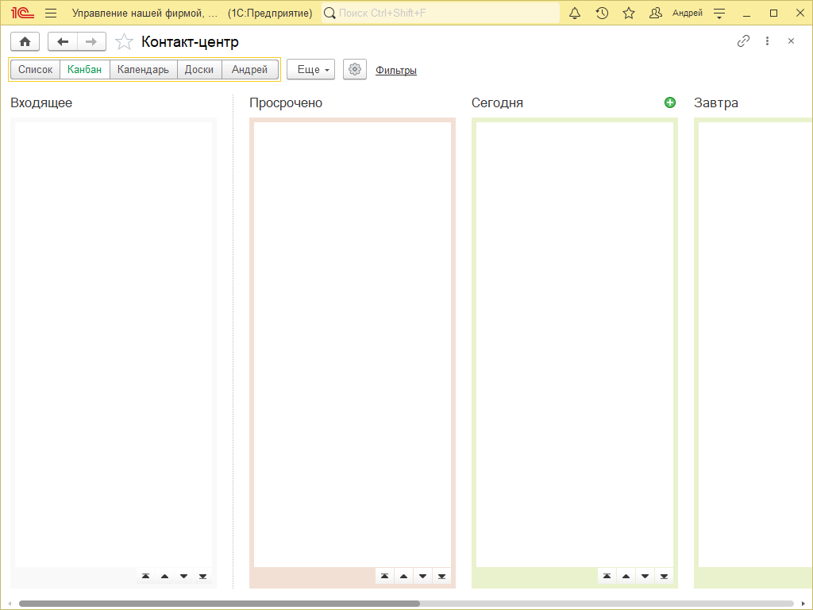

# Моя база знаний

```vscode
Foam: Show Graph
```

```vscode
Foam: Create New Note from Template
```

`alt+d` создает ежедневную заметку

`- [ ]` создает список с флажками

`alt+с` пометить флажок как прочитанный или снять флаг

`ctrl+b` **сделать** болдом

`ctrl+i` *италик*

`ctrl+alt+v` вставка картинок из буфера

`alt+d` создает заметку с текущей датой в папке journal.

`- [ ]` создает список

## Создание ссылок 

1. copy the following text: [Гугл](https://google.com)
2. `[Гугл](https://google.com)`

[Начало](getting-started.md)   

## Tables

`alt+shift+f` formats a table. Place the cursor in the table below and format the table.

| column 1 | column 2|
|-|-|
| one element | another element|
| second row| last cell|

---

## Search

Search in your repo with `cmd+shift+f`: type "search" (go back to the file explorer with `cmd+shift+e`)

## Templates

`Foam: Create New Note From Template`

- `list`
- `note`

## Вставка нескольких картинок

Статьи затрат



Главное меню



СРМ




